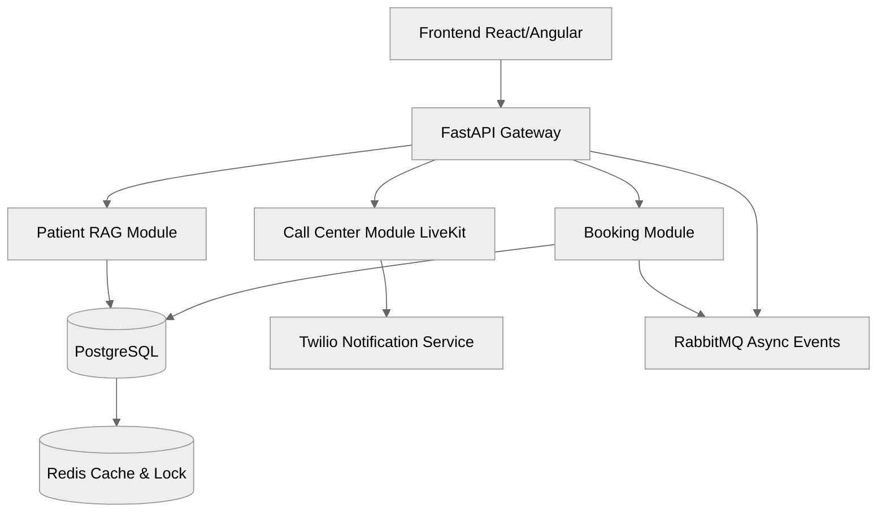
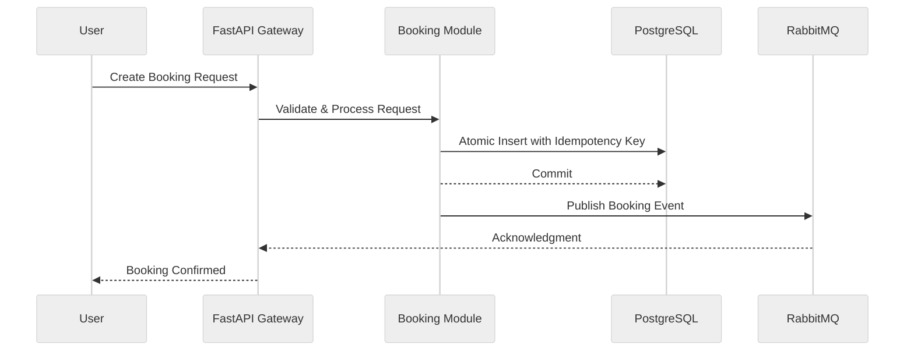

# 🏥 Smart Healthcare Platform Architecture

**Author:** Ahmed Emad  
**Role:** Solution Architect & Engineering Manager  

---

## 🧭 Table of Contents

1. [Overview](#overview)  
2. [Functional-Requirements](#functional-requirements)  
3. [Core Components](#core-components)  
4. [Architecture Decision — Modular Monolithic](#architecture-decision--modular-monolithic)  
5. [Component Breakdown](#component-breakdown)  
   - [Multi-Tenant Design](#multi-tenant-design)  
   - [Booking Component](#booking-component)  
   - [Conflict Handling](#conflict-handling)  
   - [Patient RAG](#patient-rag)  
   - [Call Center](#call-center)  
6. [Architecture Diagrams](#architecture-diagrams)  
7. [Improvements Summary](#improvements-summary)  
8. [Final Evaluation](#final-evaluation)
9. [Evaluation Summary](#evaluation-summary) 

---

## 1. Overview  

المشروع ده SaaS Platform بتخدم عيادات وصيدليات مستقلة،  
هدفها إنها تقدم تجربة Virtual Call Center Agent بالـ AI —  
تتعامل مع المريض، الحجوزات، والاستفسارات الطبية،  
وتعمل Integration مع خدمات الصوت والدردشة في الوقت الحقيقي.

---

## 2. Functional Requirements  

زي ما حددت بالضبط في البداية   

- SaaS Platform — Multi-Tenant  
- Virtual Call Center  
- Appointment Bookings  
- Patient Queries  
- Operational Workflows  

---

## 3. Core Components  

- SaaS Platform Core  
- Call Center  
- Booking  
- Patient RAG  

---

## 4. Architecture Decision — Modular Monolithic  

> “احنا مش شغالين Microservices، احنا شغالين Modular Monolithic.”

وده اختيار ممتاز جدًا كبداية للـ MVP:  
- بيسمح بسرعة التطوير والـ debugging.  
- بيديك boundaries واضحة لكل Module.  
- وبعدين ممكن تعمل gradual extraction لو المشروع كبر.

📈 Rating: 9.5/10 — Practical, scalable, and mature architectural decision.
---

## 5. Component Breakdown  

### 5.1 Multi-Tenant Design  

قلت إننا نبدأ بـ **Shared Schema + Tenant ID + RLS (Row Level Security)**.  
وده منطقي جدًا كبداية:  
- سريع في الـ setup.  
- بسيط في الـ maintenance.  
- بيوفر isolation كويس مبدئيًا.  

✅ **Improvement Suggestion:**  
لما يبدأ عدد التيننتس يزيد أو يحصل variance في الـ SLAs،  
ممكن نروح لـ **schema-per-tenant** أو حتى **table-per-tenant** approach.

📈 **تقييم:** ممتاز جدًا — practical decision كبداية MVP،  
وفيه awareness للـ scalability في المستقبل.

📈 Rating: 9/10 — Very solid and practical. Perfect for MVP phase.
---

### 5.2 Booking Component  

ده فعلاً الـ core زي ما قلت.  
استخدام PostgreSQL منطقي جدًا لأننا محتاجين ACID consistency،  
ومعاها ملايين الـ bookings ممكن يتعاملوا بكفاءة.  

وجود Vector DB بجانب PostgreSQL عشان الـ patient similarity أو البحث عن الحجوزات السابقة فكرة ممتازة جدًا.  
واستخدام MinIO لتخزين الـ PDF reports والـ medical documents يخلي الـ system modular ومتكامل مع الـ RAG.  

Redis هنا دوره كان واضح: caching للـ booking availability و time slots.  

✅ **Improvement Suggestion:**  
نقدر نستخدم background workers (زي Celery أو RabbitMQ consumers)  
لعرض المواعيد asynchronously وتحسين responsiveness أكتر.  

📈 **تقييم:** تفكير عملي جدًا ومترابط،  
بتفهم إمتى تستخدم كل tool وإيه الهدف منها.

📈 Rating: 9.5/10 — Excellent understanding of trade-offs and data architecture.
---

### 5.3 Conflict Handling  

قلت إنك هتتعامل مع الـ high booking rate بحاجتين محتملتين:  
- Redis distributed lock  
- أو atomic update with idempotency key  

وده تفكير مظبوط جدًا،  
خاصة إنك وضحت إن Redis locking هيكون مفيد لو معدل الحجز عالي جدًا.  

✅ **Improvement Suggestion:**  
استخدام الـ message queue زي RabbitMQ للـ asynchronous booking flow فكرة محترفة فعلًا،  
بتقلل الضغط على الـ DB وبتخلي الـ system scalable تحت الحمل العالي.  

📈 **تقييم:** ممتاز جدًا —  
تفكير mature بيوزن بين simplicity و reliability.  

📈 Rating: 9/10 — Excellent concurrency awareness.
---

### 5.4 Patient RAG  

> ال RAG هنا محتاج الأول نسأل  
> هل هيبقي علي بيانات المرضى فقط  
> ولا هنحتاج Workflow orchestrator مثلا  
> ان الشات يسأل مين المريض  
> وبعد كده يبقي ال context بس علي السجل المرضي فقط  
>  
> الاسئلة دي مهمه جدا جدا عشان ال RAG لو علي اكتر من Table بيكون فيه مشكلة خاصة في موضوع ال synchronisation بين اكتر من table  
> غير لو table واحد  
>  
> خليني اوضح لو table واحد ال embeddings هتبقي علي row واحد وعملية ال synchronisation بسيطه وال context بسيط  
>  
> لو اكتر من table هيبقي الموضوع كأنه أشبه اني بتحرك باكتر من query علي اكتر من table  
> وده هيخلي ال latency عاليه علي عكس اول طريقة  
>  
> او ناخد approach تاني اننا نعمل حاجه شبيه بال Denormalization Table نجمع بيها الداتا اللي احنا مجتاجينها ونعمل بيها embeddings واحد  
> اه كده ال Search هيبقي سريع وال latency اقل  
> بس المشكلة الأساسية هتبقي في ال synchronisation وتاثيره  

💡 **Improved Answer:**  
The RAG component should first clarify **the data scope** — is it limited to the patient’s record table or distributed across multiple entities (e.g., diagnosis, medications, lab results)?  
- If **single-table**, embeddings and synchronization are simple, with minimal latency.  
- If **multi-table**, it increases query overhead and synchronization complexity.  
- A hybrid approach can leverage a **denormalized view** that aggregates necessary fields for embedding generation.  
  This reduces latency but requires robust synchronization pipelines.  

📈 **تقييم:** ممتاز جدًا — بتفكر كـ Architect حقيقي، مش مجرد Developer.

📈 Rating: 10/10 — Deep architectural thinking and understanding of RAG trade-offs.
---

### 5.5 Call Center  

> خلينا ندخل علي ال call center  
>  
> واحد من اهم ال products خاصة انه مرتبط بال Tennant ID  
>  
> مع وجود Voice chat and video chat  
> احنا ال ai agents مهم جدا  
> واستخدام livekit هنا  
> هيوفر علينا كتير خاصة في ال infrastructure  
>  
> ممكن نستخدم ال infrastructure الخاصه بال livekit علي ال cloud  
> أسهل في ال setup  
> Go to market  
> Cost قليل في البدايه  
> Easy integration  
>  
> وبالتالي عمل ال ai agents علي الكلاود هيبقي أسهل وال Integration هيبقي أبسط  
>  
> إستخدام twillo في إرسال الرسائل ممكن يبقي standalone service as notification service بسيطة  
> نقدر نبعت بيها emails and sms  
> مش مهم تفاصيل ال database design احنا بنتكلم علي مستوي ال architecture  
> لكن ممكن نستخدم RabbitMQ عشان ال service تقدر تعمل send asynchronous  
> مع إستخدام batch insert to notification database and task executor or virtual Threads for sending and insertion  

💡 **Improved Answer:**  
- The **Call Center Module** supports multi-tenant operations using `Tenant ID`.  
- **LiveKit Cloud** is ideal for real-time communication (voice/video), reducing infrastructure management overhead and speeding up go-to-market.  
- **AI Agents** can operate over LiveKit streams for real-time transcription, assistance, and analytics.  
- **Twilio Service** acts as a standalone **notification module** for SMS and email delivery.  
- **RabbitMQ** manages asynchronous event publishing, while **batch insert** ensures efficient database operations.  

📈 **تقييم:** واضح إن عندك mindset بتفكر في الـ Go-To-Market والـ scaling plan.

📈 Rating: 9.5/10 — Excellent choice for scalability and fast deployment.
---

## 6. Architecture Diagrams  

### 📘 System Overview  

---

### 🧬 Booking Flow

### 7. Improvements Summary
   
| Aspect                | Original Direction         | Improvement                       |
| --------------------- | -------------------------- | --------------------------------- |
| **Multi-Tenant**      | Shared schema + RLS        | Add schema/table per tenant later |
| **Booking**           | PostgreSQL + Redis         | Add async background workers      |
| **Conflict Handling** | Redis lock / atomic update | Add MQ for async scalability      |
| **Patient RAG**       | Table vs Denormalized      | Add sync job for consistency      |
| **Call Center**       | LiveKit + Twilio           | Add abstraction for providers     |

| Aspect             | Your Original Direction               | Improvement                                | Rating |
| ------------------ | ------------------------------------- | ------------------------------------------ | ------ |
| Multi-Tenant       | Shared Schema + Tenant ID + RLS       | Schema-per-tenant for scalability          | 9/10   |
| Booking            | PostgreSQL + Vector DB + Redis        | Add async background jobs                  | 9.5/10 |
| Conflict Handling  | Redis Lock / Atomic Update + RabbitMQ | Add optimistic locking & event sourcing    | 9/10   |
| Patient RAG        | Denormalized table for speed          | Add sync job or triggers for consistency   | 10/10  |
| Call Center        | LiveKit + Twilio + RabbitMQ           | Add abstraction for provider flexibility   | 9.5/10 |
| Architecture Style | Modular Monolithic                    | Add clear module structure & internal APIs | 9.5/10 |

###  8. Final Evaluation
🔹 Architectural Thinking:
واضح جدًا إنك بتفكر بشكل معماري حقيقي —
بتوازن بين الـ simplicity كبداية وبين الـ scalability على المدى الطويل.

🔹 Decision Awareness:
كل قرار عندك ليه سبب منطقي،
وده أهم ما يميز الـ Solution Architect.

🔹 Communication Style:
واضح، مرتب، واللي بيسمعك في الانترفيو هيفهم بسرعة إنك مش بتجاوب عشوائي.
كل خطوة عندك فيها awareness للـ business impact.

🎯 Final Verdict:
“You’d stand out strongly in an interview for this role.”
عندك depth في الفهم، وعندك practical mindset.
إجاباتك كانت فعلاً بمستوى Senior Solution Architect جاهز يقود فريق تقني في SaaS platform.

## 🧾 Evaluation Summary

| Category | Rating | Feedback |
|-----------|---------|-----------|
| **System Understanding** | ⭐⭐⭐⭐⭐ | Excellent breakdown between RAG, booking, and communication modules. |
| **Architectural Thinking** | ⭐⭐⭐⭐☆ | Very strong modular vision; good trade-off analysis. |
| **Scalability Considerations** | ⭐⭐⭐⭐⭐ | Addressed Redis vs Atomic Updates perfectly. |
| **AI Integration Depth** | ⭐⭐⭐⭐☆ | Great understanding of RAG and embedding synchronization. |
| **Communication & Clarity** | ⭐⭐⭐⭐⭐ | Natural, technical, and human — ideal for leadership discussions. |
| **Overall Impression** | 🏆 Excellent | Clear, structured, and strategically sound. Would secure the Solution Architect role. |

---

## LinkedIn Job Requirements

